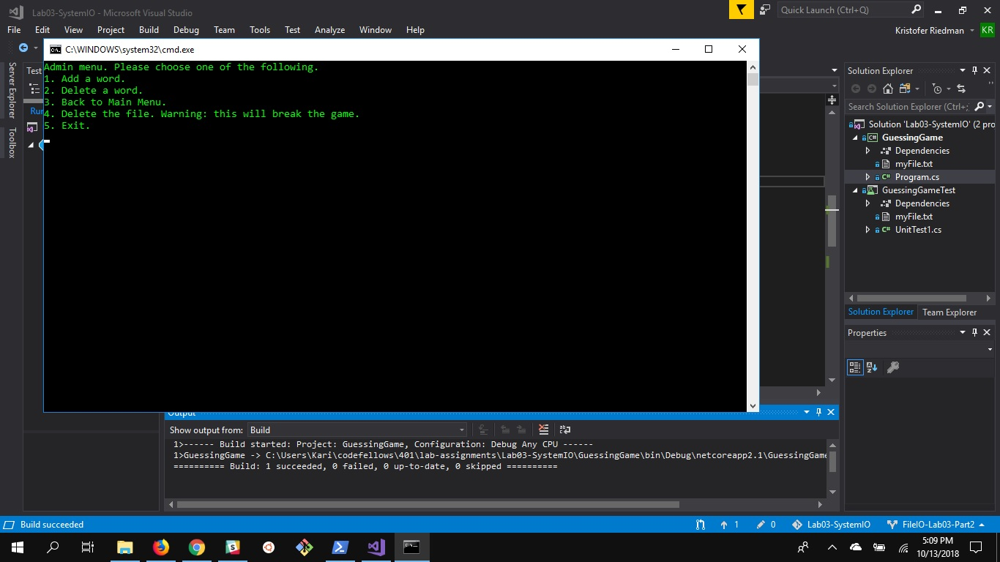

# Lab03-SystemIO
## Description
This app is a guessing game that utilizes CRUD operations on a local file.  The user can add words and remove words from the possible word pool. The game portion lets users guess a letter.  If the letter is in the word, the program will indicate this. The program will also keep track of previous user guesses.

## User Instructions
In order to run this program, follow the directions below.
1. Open the solution file in Visual Studio
2. Run the program without debugging
3. Follow on screen prompts to either play the guessing game or perform admin actions

## Visuals

